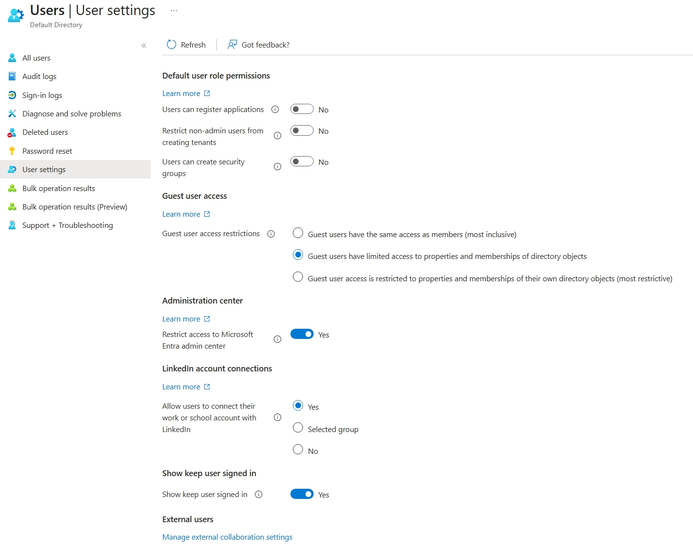
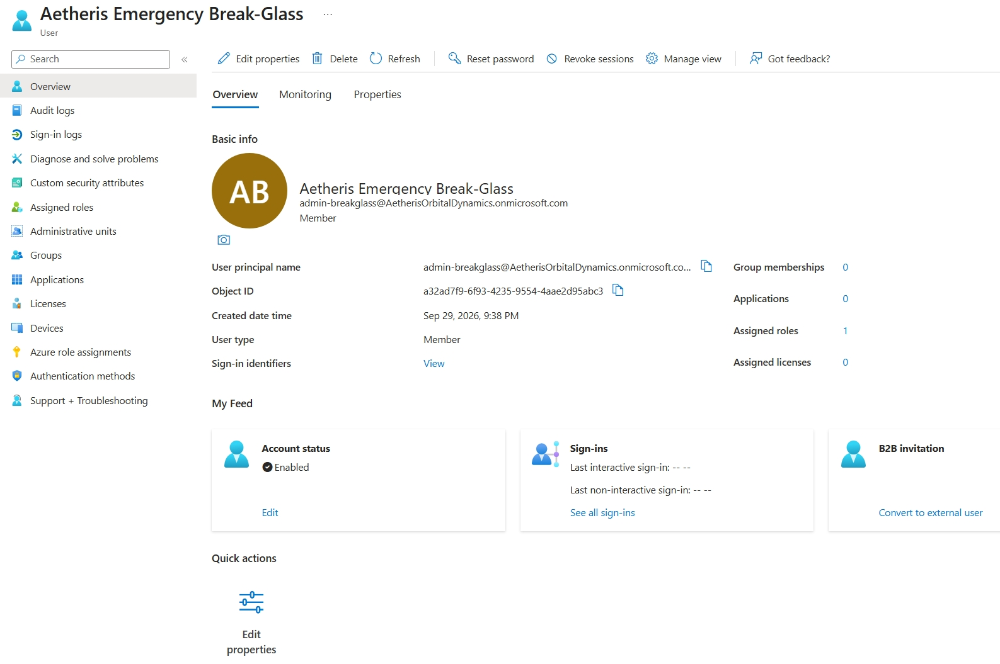
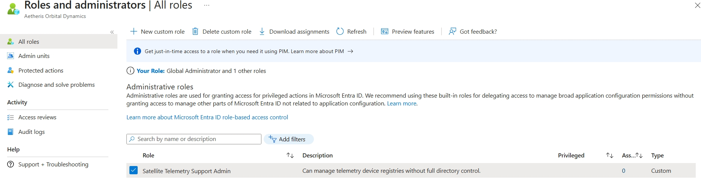

# 🛰️ Lab 01: Tenant Baseline Hardening & Custom RBAC
**Organization:** Aetheris Orbital Dynamics[cite: 1]  
**Environment:** Microsoft Entra ID P2[cite: 1]  
**Status:** Secured & Operational  

---

## 🚀 1. What is the business problem or operational objective?
At **Aetheris Orbital Dynamics**, we manage high-stakes ground-station communication feeds and real-time satellite telemetry tracking[cite: 1]. When you're dealing with orbital assets, security isn't just an afterthought—it's mission-critical. 

Right out of the box, default cloud tenants leave wide-open attack vectors: unmanaged app registrations, unrestricted user privileges, and zero-perimeter visibility. Our core objective for this phase was simple: lock down the baseline control plane, establish a bulletproof emergency recovery protocol, and engineer a least-privilege custom role tailored specifically for our telemetry support crews without handing out the keys to the kingdom[cite: 1].

---

## 🛡️ 2. What architecture or configuration was implemented?
To establish a hardened, production-grade enterprise posture, we deployed three core security controls within our Entra ID P2 environment[cite: 1]:

* **Tenant-Wide Security Hardening:** Stripped default user permissions by blocking unauthorized application onboarding and restricting access to the core Microsoft Entra administration portal to prevent lateral discovery and enumeration[cite: 1].
* **Emergency "Break-Glass" Protocol:** Provisioned a heavily isolated, cloud-only Global Administrator account (`admin-breakglass`) completely decoupled from federated identity providers. This ensures absolute fail-safe access during a catastrophic IdP outage[cite: 1].
* **Granular Custom RBAC (`Satellite Telemetry Support Admin`):** Leveraged Entra ID P2 custom roles to build a specialized permission set. Support engineers get exactly the `deviceRegistrationPolicy` access they need to manage telemetry hardware registries—and not an ounce of unnecessary directory-wide power[cite: 1].

---

## 🔍 3. How was it verified and tested?
* **Posture Enforcement:** Validated that standard user tokens are actively blocked from provisioning unauthorized portal paths or creating unvetted app registrations.
* **Break-Glass Audit:** Confirmed clean provisioning and role assignment for the emergency recovery account, ensuring immediate visibility in high-privilege access reviews.
* **Role Scoping Test:** Verified the successful compilation of the custom telemetry support role, ensuring its permission boundaries map precisely to operational requirements.

---

## 💡 4. What are the operational takeaways & security considerations?
* **Least Privilege by Design:** Scoping administrative roles tightly prevents privilege creep and limits blast radiuses if a support account is ever compromised.
* **Aggressive Monitoring on Break-Glass:** Because emergency accounts possess absolute authority, they must sit behind rigorous, automated sign-in and audit log alerts. Any active session triggers instant high-priority SOC escalations.
* **Zero Trust Foundation:** Never trust a default configuration. Cloud hardening must happen *before* a single workload, sensor feed, or hardware device is ever introduced to the tenant[cite: 1].

---

## 📸 Implementation Gallery

### User Settings & Portal Hardening

### Emergency Break-Glass Account

### Custom Satellite Telemetry RBAC Role

