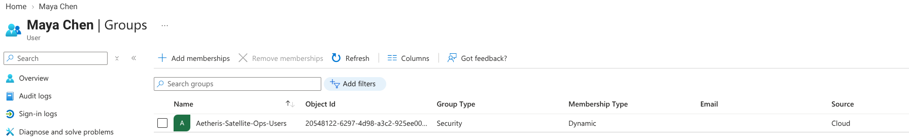
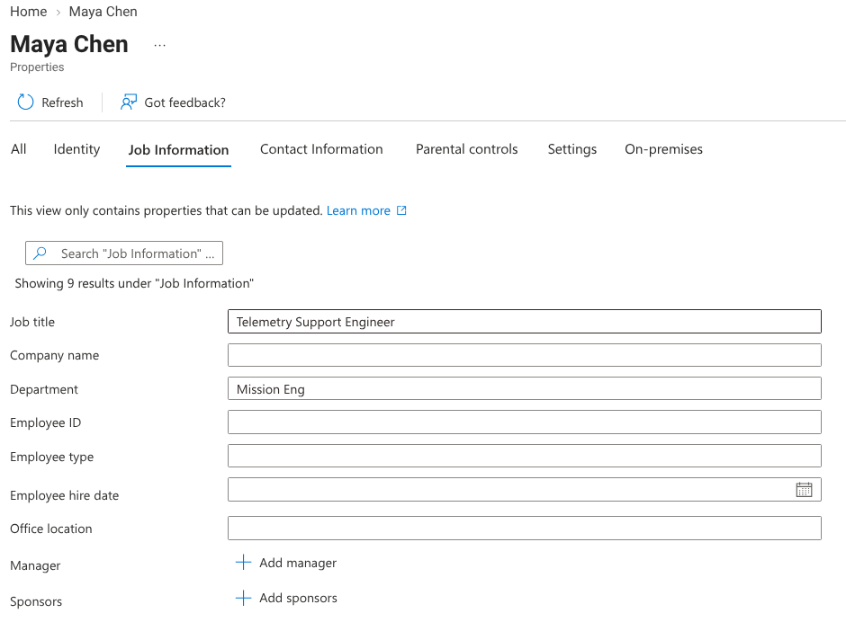
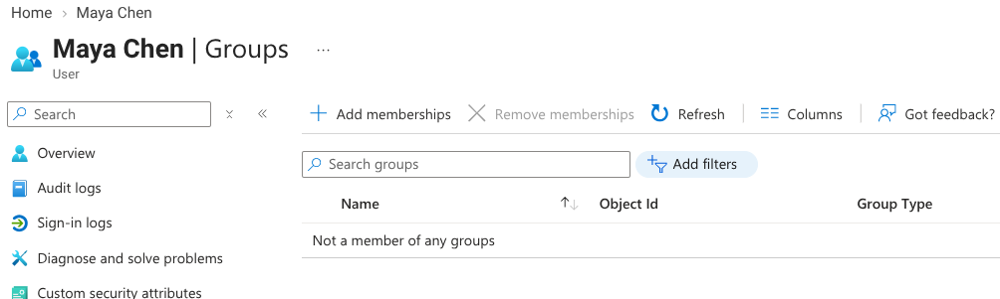
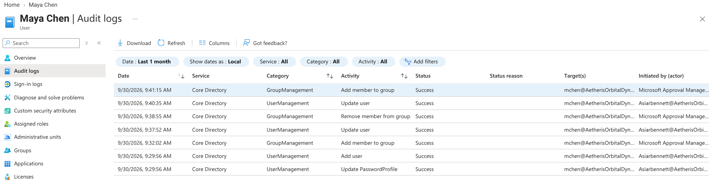
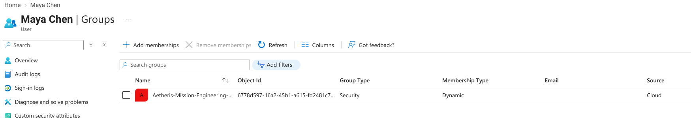

# 🚀 Lab 03 — Automated Mover: Automated Legacy Access Removal

**Organization:** Aetheris Orbital Dynamics  
**Environment:** Microsoft Entra ID P2 Status: Secured & Operational 🛡️

---

## ⚡ 1. What is the business problem or operational objective?
When engineers transition across high-stakes divisions at Aetheris Orbital Dynamics—such as moving from Satellite Operations to Mission Engineering—traditional IT environments often fall victim to **privilege creep and access accumulation**. Giving an employee new permissions without stripping away legacy clearance creates massive internal attack surfaces. 

Our core objective for this phase was to engineer an automated "Mover" lifecycle workflow leveraging Entra ID dynamic groups tied to department attributes, enabling automated access provisioning and removal based on department attributes. Furthermore, this lab incorporates a **deliberate fault-injection troubleshooting scenario** to validate administrative resilience against attribute string mismatches.

---

## 🛠️ 2. What architecture or configuration was implemented?
To establish an attribute driven cross division workflow, we deployed three core controls within our Entra ID P2 environment:
* **Attribute-Driven Dynamic Memberships:** Configured Entra ID security groups with advanced rule syntax (`user.department -eq "..."`) to automatically evaluate and assign group membership based on authoritative HR attributes.
* **Automated Privilege Revocation:** Built the dynamic logic to ensure that once a user's department changes, Entra ID automatically drops them from legacy department groups, eliminating orphan access without manual ticket queues.
* **Controlled Fault-Injection Test:** Deliberately introduced an attribute typo (`Mission Eng`) during the transfer simulation to test rule evaluation failures, followed by remediation to the exact string (`Mission Engineering`).

---

## ✅ 3. How was it verified and tested?
* **Baseline State Audit (`01-before-transfer.jpeg`):** Verified Maya Chen's initial placement as a Telemetry Support Engineer in Satellite Operations alongside her active legacy group memberships.
* **Attribute Mutation & Fault Injection (`02-attribute-change.jpeg` & `03-dynamic-membership.jpeg`):** Updated her department field and tracked the dynamic group evaluation engine, observing how minor string discrepancies halt provisioning until corrected.
* **Access Reconciliation & Cleanup (`04-legacy-access-removed.jpeg` & `05-final-access-state.jpeg`):** Confirmed that correcting the department string triggered dynamic group reevaluation—successfully granting Mission Engineering resources while completely stripping away Satellite Operations access.

---

## 🔑 4. What are the operational takeaways & security considerations?
* **Zero Privilege Accumulation:** Automated mover workflows ensure former clearance levels do not follow employees into new business units, adhering strictly to the Principle of Least Privilege.
* **Data Hygiene Dependence:** Dynamic membership rules rely heavily on strict HR data consistency; minor typos can break access provisioning, making monitoring and audit alerts critical.
* **Audit-Ready Transitions:** Every attribute change and group transition is natively logged in Entra ID, providing clear compliance trails for defense-sector auditing.

---

## 📸 Implementation Gallery

### 1. Pre-Transfer Baseline State

### 2. Department Attribute Update & Fault Injection

### 3. Dynamic Group Membership Evaluation & Troubleshooting

### 4. Legacy Access Revocation (Privilege Mitigation)

### 5. Final Reconciled Access State

