# 🔐 Lab 04 — Automated Identity Offboarding with Microsoft Graph

## Operational Objective

This lab demonstrates an automated identity offboarding workflow for **Aetheris Orbital Dynamics** using Microsoft Entra ID, Python, MSAL, and the Microsoft Graph REST API.

The objective was to reduce reliance on manual administrative actions during the leaver process while keeping access removal controlled, intentional, and verifiable.

The workflow was designed to:

- Identify the target user and validate the current account state
- Discover and classify existing group memberships
- Disable the Entra ID account
- Revoke existing sign-in sessions
- Distinguish dynamic memberships from directly assigned access
- Remove only explicitly approved assigned group access
- Protect attribute-driven dynamic memberships from manual removal
- Verify identity and access changes after execution
- Safely handle repeated execution when the desired state has already been reached

---

## 👤 Offboarding Scenario

**Jordan Reyes**, a Mission Systems Engineer within the **Mission Engineering** department, is leaving Aetheris Orbital Dynamics.

Prior to offboarding, Jordan had:

- An enabled Entra ID account
- An active authenticated Microsoft session
- Dynamic access through `Aetheris-Mission-Engineering-Users`
- Directly assigned access through `Aetheris-Mission-Control-Operators`

The automation was designed to disable Jordan's identity, revoke existing sessions, remove approved directly assigned access, and verify the resulting identity state without manually removing access governed by dynamic membership rules.

---

## 🏗️ Architecture & Configuration

The offboarding workflow uses a registered Microsoft Entra application to authenticate to Microsoft Graph using the OAuth 2.0 client credentials flow.

### Architecture

```text
Python Offboarding Script
        │
        ▼
MSAL Authentication
        │
        ▼
Microsoft Identity Platform
        │
        ▼
Microsoft Graph REST API
        │
        ▼
Microsoft Entra ID
        │
        ├── User Account
        ├── Sign-In Sessions
        └── Group Memberships
```

The Python script uses **MSAL** to obtain an application access token. The token is then used to authorize HTTP requests sent directly to Microsoft Graph.

### Application Registration

A dedicated Microsoft Entra application registration was created for the workflow:

`Aetheris IAM Offboarding Automation`

Application permissions were used because the workflow was designed for non-interactive automation rather than requiring an administrator to sign in each time the script runs.

### Microsoft Graph Permissions

The following Microsoft Graph application permissions were configured and granted admin consent:

| Permission | Purpose |
|---|---|
| `User.Read.All` | Read the target user's identity information |
| `User.EnableDisableAccount.All` | Disable the target Entra ID account |
| `User.RevokeSessions.All` | Revoke the user's sign-in sessions |
| `GroupMember.ReadWrite.All` | Remove approved assigned group memberships |

The permission set was scoped to the operations required by the workflow rather than using a broader directory-wide write permission.

### Credential Handling

Application credentials are loaded from a local `.env` file rather than being hard-coded into the Python script.

The environment file contains:

- `TENANT_ID`
- `CLIENT_ID`
- `CLIENT_SECRET`

The `.env` file is excluded from source control through `.gitignore`.

A separate `.env.example` file documents the variables required to run the project without exposing the actual credentials.

Before staging the project, Git's ignore configuration was explicitly validated to confirm that the real `.env` file would not be included in the repository.

---

## ⚙️ Automation Workflow

The Python workflow follows a controlled **discover → evaluate → act → verify** process.

### 1. Authenticate to Microsoft Graph

MSAL uses the application's tenant ID, client ID, and client secret to request an application access token using the client credentials flow.

The access token is kept in memory and used in the authorization header for subsequent Microsoft Graph requests.

### 2. Locate the Target Identity

The workflow queries Microsoft Graph using Jordan's user principal name and retrieves the properties required for the offboarding process:

- Object ID
- Display name
- User principal name
- Account status

This establishes the identity's current state before any changes are made.

### 3. Discover Existing Access

The script retrieves Jordan's current group memberships and evaluates each membership before performing access removal.

During testing, two different access models were identified:

| Group | Membership | Offboarding Decision |
|---|---|---|
| `Aetheris-Mission-Engineering-Users` | Dynamic | Skip manual removal |
| `Aetheris-Mission-Control-Operators` | Assigned | Approved for removal |

The workflow identifies dynamic groups through the `DynamicMembership` value returned in the group's `groupTypes` property.

### 4. Disable the Account

If the account is enabled, the workflow updates the Entra ID user through Microsoft Graph and sets:

```json
{
  "accountEnabled": false
}
```

If the account is already disabled, the action is skipped rather than unnecessarily repeating the write operation.

### 5. Revoke Sign-In Sessions

After account disablement, the workflow sends a request to the Microsoft Graph `revokeSignInSessions` action.

API execution time is measured separately from observed browser-session behavior.

During testing, the API successfully accepted the session-revocation request. When Jordan's previously authenticated browser session was tested afterward, access was blocked and the account was reported as locked.

> **Note:** API execution time is not treated as the exact session termination time. Session enforcement and token behavior may not occur at the exact moment the Graph request completes.

### 6. Remove Approved Assigned Access

The workflow does not automatically remove every non-dynamic group membership.

Instead, an explicit allowlist defines the assigned groups that the automation is authorized to remove:

```python
OFFBOARDING_MANAGED_GROUPS = {
    "Aetheris-Mission-Control-Operators"
}
```

Jordan's membership in `Aetheris-Mission-Control-Operators` met both conditions required for removal:

1. The membership was directly assigned rather than dynamic.
2. The group was explicitly included in the offboarding allowlist.

The membership reference is removed using the Microsoft Graph group membership endpoint ending in `/$ref`.

Dynamic membership in `Aetheris-Mission-Engineering-Users` is intentionally left untouched because that access is controlled by directory attributes and the group's dynamic membership rule.

### 7. Verify the Result

The workflow queries Microsoft Graph again after access removal to verify that the assigned group is no longer returned.

Verification uses a limited retry process rather than assuming that a successful write response must be reflected by an immediate read request.

During testing, the group-removal request returned successfully before the first immediate membership query reflected the change. The Entra admin center subsequently showed that the assigned membership had been removed.

This behavior reinforced the need to verify the resulting directory state rather than treating an API response alone as proof of the final access state.

---

## 🛡️ Security & Safety Controls

The workflow includes several controls intended to prevent overly broad or accidental access changes.

### Explicit Group Allowlist

Only groups explicitly listed in `OFFBOARDING_MANAGED_GROUPS` are eligible for automated removal.

Assigned memberships outside the allowlist are left unchanged.

### Dynamic Membership Protection

Groups identified with `DynamicMembership` are excluded from manual membership removal.

This prevents the automation from attempting to override access that is controlled through directory attributes and dynamic membership rules.

### State-Aware Execution

The workflow checks the user's current state before performing certain actions.

For example, an already-disabled account is detected and the disable operation is skipped.

### Post-Action Verification

Access removal is followed by a separate read operation to validate the resulting membership state.

A limited retry mechanism handles cases where a successful directory write is not immediately reflected in a subsequent read.

### Secret Protection

Tenant credentials and the client secret are stored locally in `.env` and excluded from Git tracking.

Only `.env.example`, containing placeholder values, is included in the repository.

### Request Timeouts and Error Handling

Microsoft Graph requests use defined timeouts, and failed API operations return HTTP status information rather than silently continuing through the workflow.

---

## 🧪 Testing & Validation

Testing was performed incrementally so each stage of the workflow could be validated before introducing the next write operation.

The workflow was tested in the following order:

1. Confirmed application authentication through MSAL
2. Located Jordan through Microsoft Graph
3. Validated the pre-offboarding account state
4. Retrieved existing group memberships
5. Classified dynamic and assigned access
6. Performed a dry run of the access-removal decision
7. Disabled Jordan's Entra ID account
8. Verified the account reported `accountEnabled: false`
9. Revoked existing sign-in sessions
10. Tested Jordan's previously authenticated browser session
11. Removed the approved assigned group membership
12. Verified the resulting access state
13. Re-ran state checks to confirm completed actions were not unnecessarily repeated

### Observed API Execution Times

Individual API operations were timed with Python's `time.perf_counter()` during testing.

| Operation | Observed API Execution Time |
|---|---:|
| Account disable request | 0.627 seconds |
| Session revocation request | 0.563 seconds |
| Assigned group removal request | 0.305 seconds |

These measurements represent the time required for the individual HTTP operations observed during this lab. They do **not** represent guaranteed Microsoft Entra propagation time or exact end-user session termination time.

---

## 📸 Implementation Gallery

### Pre-Offboarding Identity State

Jordan's Entra ID account was enabled prior to the workflow, establishing the starting identity state for the leaver scenario.

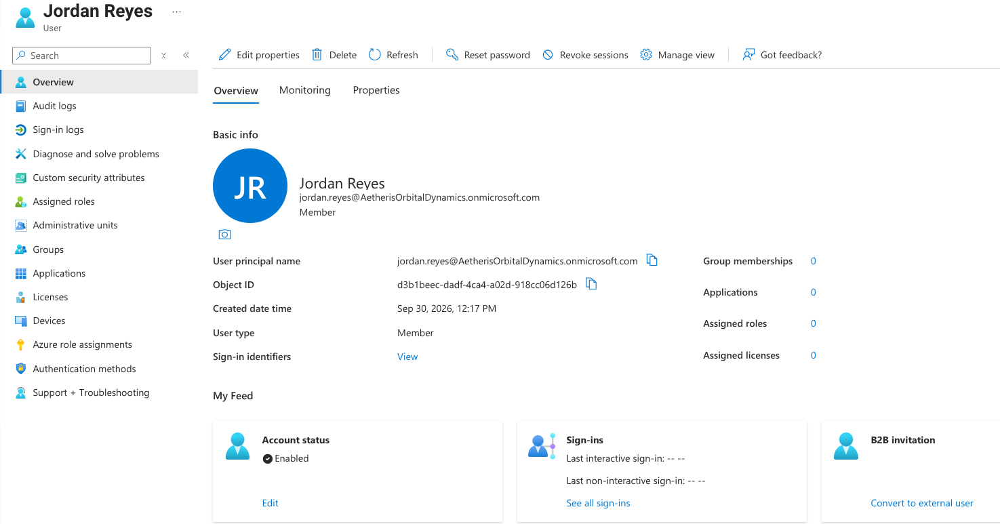

### Successful Pre-Offboarding Sign-In

Jordan successfully authenticated before offboarding, providing an active session for later session-revocation testing.

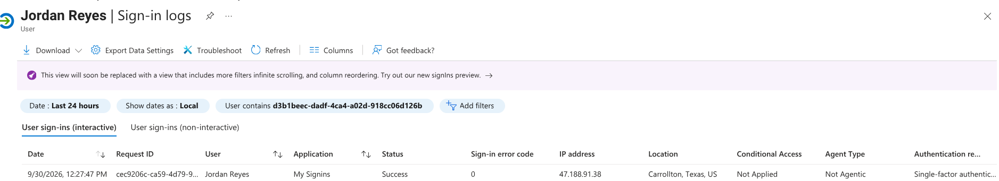

### Pre-Offboarding Access

Jordan had both dynamic Mission Engineering access and directly assigned Mission Control access prior to offboarding.

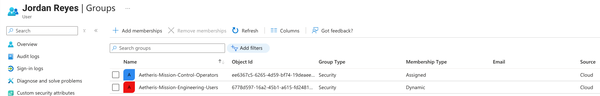

### Microsoft Graph Identity Validation

The Python workflow successfully authenticated to Microsoft Graph and retrieved Jordan's identity state before changes were made.

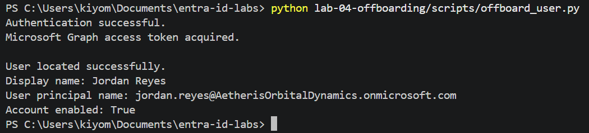

### Membership Classification

The automation distinguished Jordan's dynamic membership from directly assigned access before any group removal occurred.

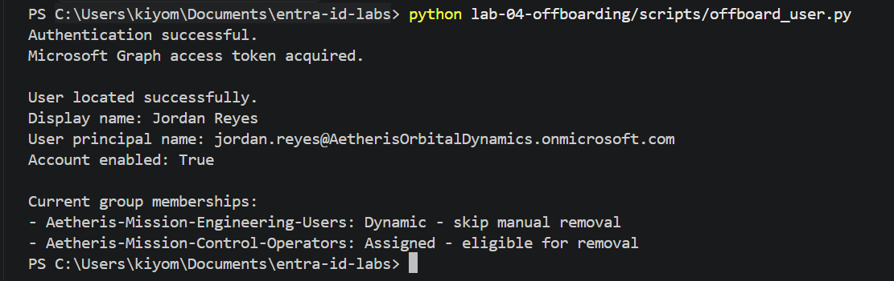

### Automated Account Disablement

Microsoft Graph successfully processed the account-disable request.

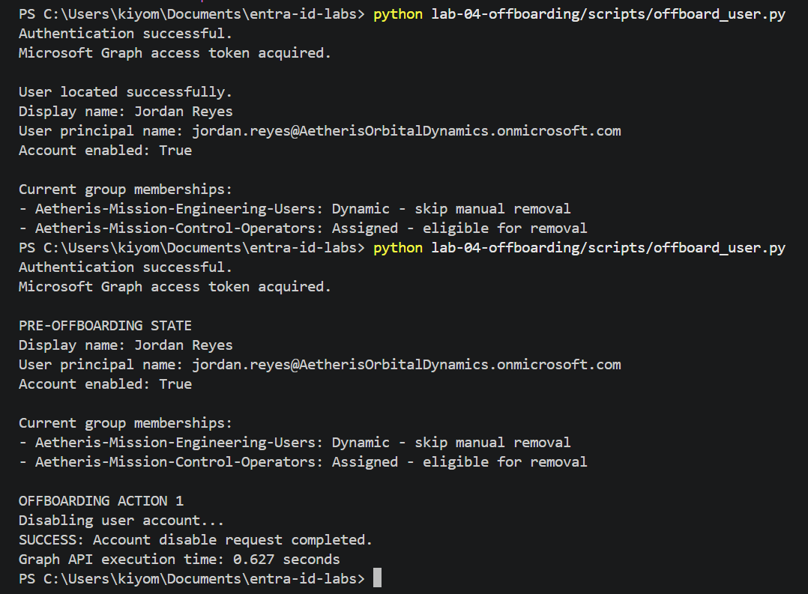

### Account State Verification

A separate Graph read confirmed that Jordan's account was disabled after the write operation.

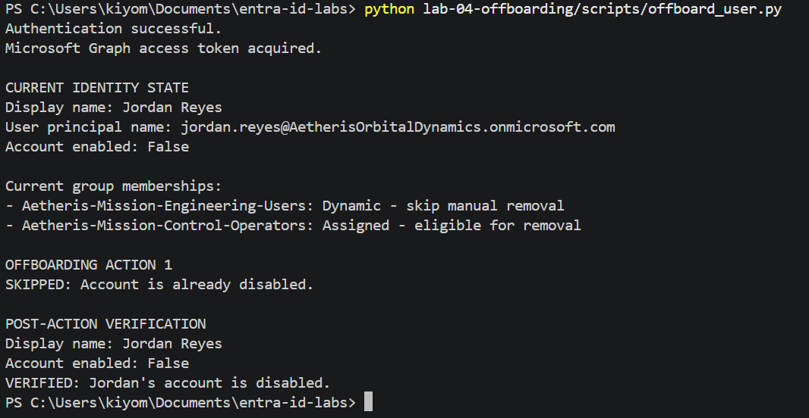

### Session Revocation

The workflow successfully submitted the sign-in session revocation request.

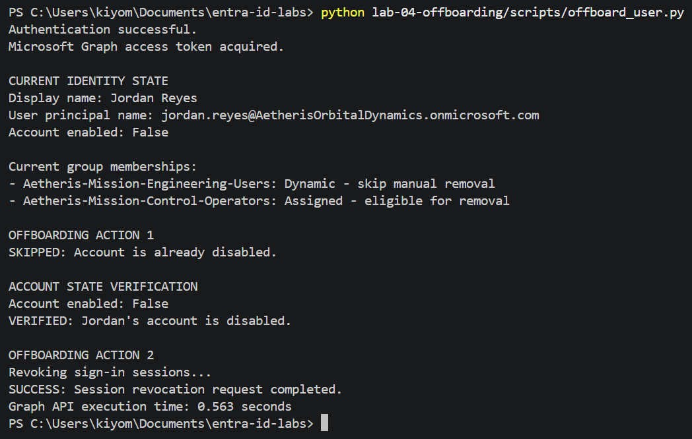

### Existing Session Access Blocked

Jordan's previously authenticated browser session was tested after the offboarding actions and could no longer be used to access the account.

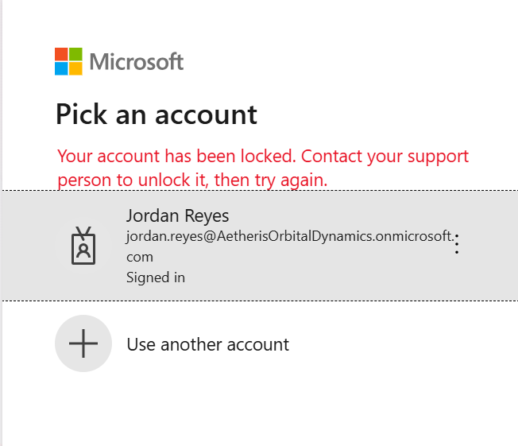

### Access Removal Dry Run

Before issuing the membership DELETE request, the automation performed a dry run showing that the dynamic group would be skipped while the allowlisted assigned group would be removed.

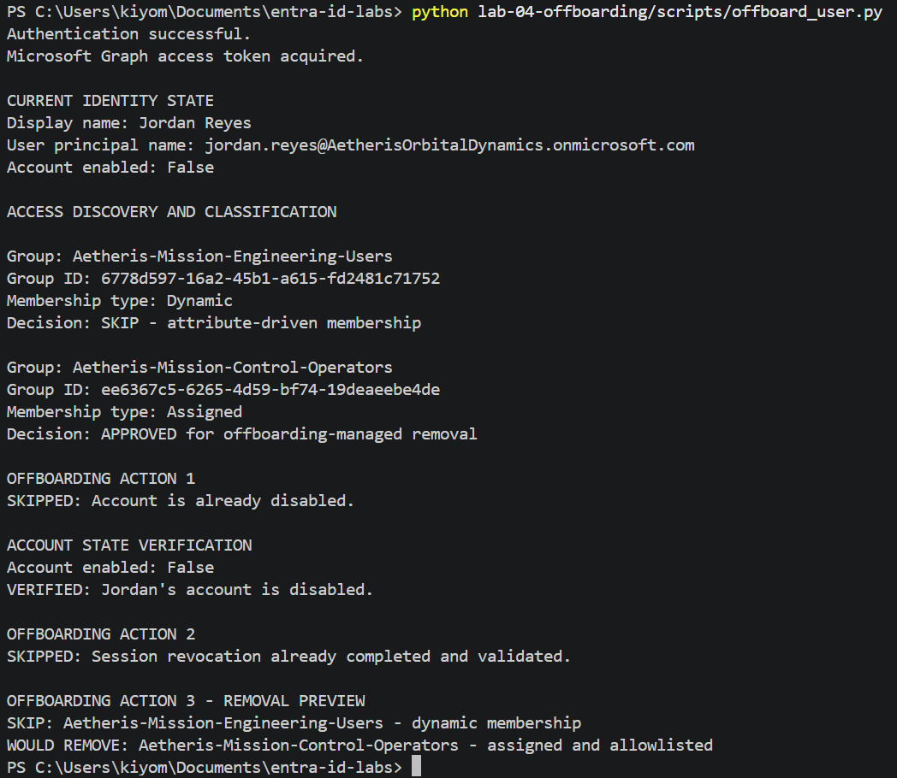

### Post-Removal Access State

The Entra admin center confirmed that the directly assigned Mission Control membership had been removed while the dynamic Mission Engineering membership remained.

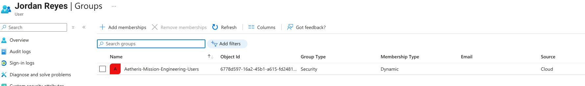

### Idempotent State Verification

A subsequent workflow execution detected that the account was already disabled and the allowlisted assigned access was already absent, preventing unnecessary repeat changes.

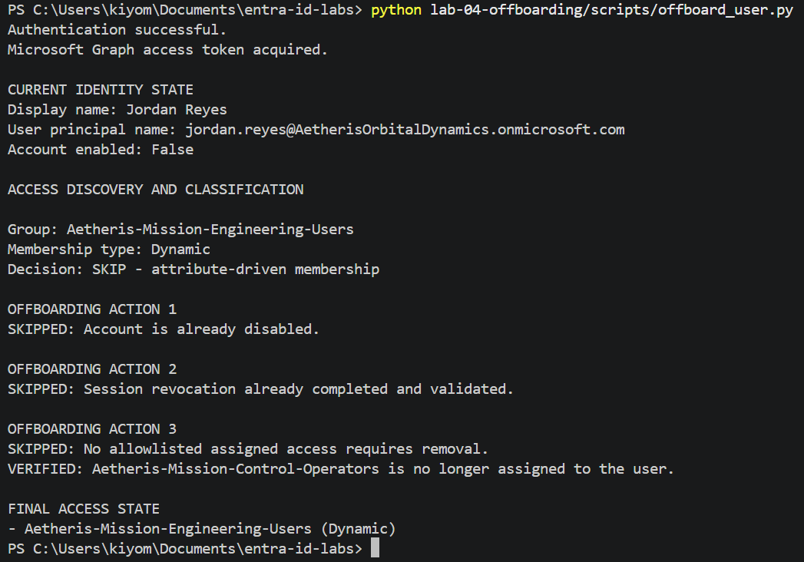

---

## 📊 Results & Operational Takeaways

The completed workflow demonstrated an automated leaver process capable of evaluating an identity's current state before making controlled changes through Microsoft Graph.

The lab successfully demonstrated:

- Programmatic authentication to Microsoft Graph using MSAL
- REST API-based identity lifecycle administration
- Automated Entra ID account disablement
- Sign-in session revocation
- Dynamic versus assigned access classification
- Allowlist-controlled group removal
- Protection of attribute-driven access
- Post-action verification with retry logic
- State-aware behavior during repeated execution
- Secure local handling of application credentials

One of the most important findings from the lab was that a successful API response and an immediately updated directory read are not always observed at the same moment. The assigned group-removal request returned successfully while the first immediate membership query still displayed the group. Subsequent validation in Entra confirmed that the membership had been removed.

For that reason, the final workflow does not rely solely on successful HTTP responses. It includes state verification and limited retries to confirm the resulting access state.

The lab also intentionally separates **API execution time** from **access enforcement and propagation**. The measured request times demonstrate automation performance observed during the test, but they are not presented as guaranteed session-revocation or directory-propagation times.

---

## Repository Structure

```text
lab-04-offboarding/
├── scripts/
│   └── offboard_user.py
├── screenshots/
├── README.md
├── requirements.txt
├── .env.example
└── .gitignore
```

The production credential file `.env` remains local and is excluded from source control.

---

## Technologies Used

- Microsoft Entra ID
- Microsoft Graph REST API
- Microsoft Authentication Library (MSAL)
- Python
- `requests`
- `python-dotenv`
- OAuth 2.0 Client Credentials Flow
- Git / GitHub

---

> **Portfolio Lab:** This environment was created for hands-on IAM engineering practice using fictional users, organizational structures, and access scenarios within Aetheris Orbital Dynamics.